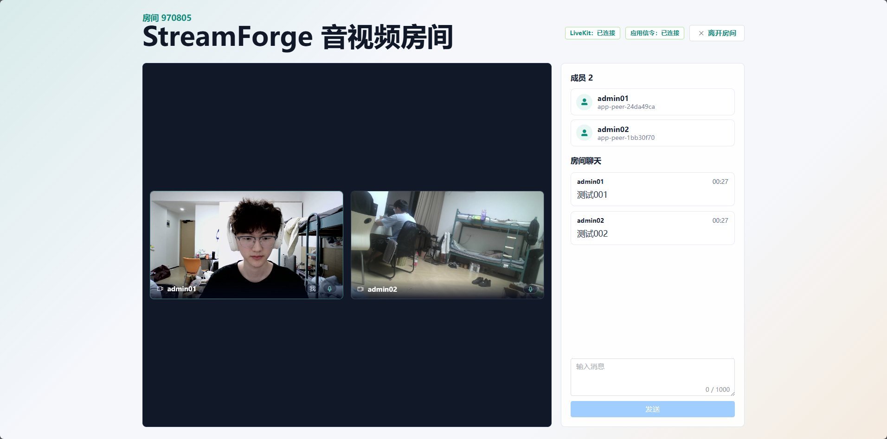
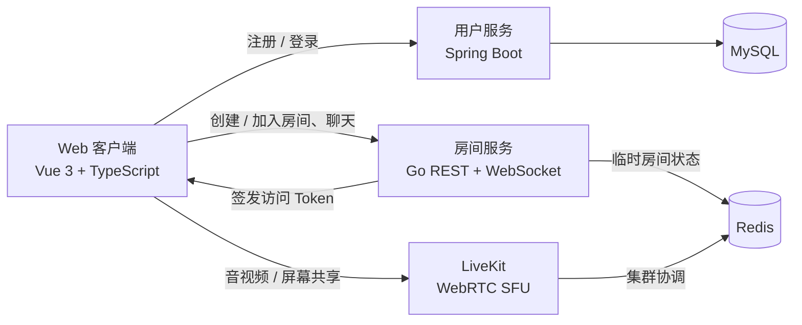

# StreamForge

<p align="center">
  一个基于 Web 的开源实时音视频会议系统。<br />
  使用 Vue 3、Go、Spring Boot 与 LiveKit 构建，聚焦清晰的服务边界与可演进的会议体验。
</p>

<p align="center">
  
  
  
  
  
</p>

> [!IMPORTANT]
> StreamForge 目前处于 MVP / 早期开发阶段，适合学习、二次开发和非关键场景试用，尚未完成生产级鉴权、安全加固、可观测性和高可用治理。



## 项目简介

StreamForge 让用户通过浏览器注册、登录、创建或加入房间，并在同一房间内进行多人音视频交流、屏幕共享和文字聊天。

项目采用独立 LiveKit 集群承载 WebRTC 信令、ICE、媒体轨道与 SFU 转发。StreamForge 自身聚焦用户、业务房间、LiveKit Token 签发、聊天和产品界面，不在 Go 服务中自研 SFU，也不保存 `PeerConnection`、SDP、ICE Candidate 或媒体 Track。

## 已实现功能

- 用户注册、登录校验与基本信息查询
- 6 位房间号创建与加入
- 后端签发 LiveKit 房间访问 Token
- 基于 SFU 的多人实时音视频通话
- 麦克风和摄像头开关
- 屏幕共享
- 房间成员列表与在线状态
- Go WebSocket 房间聊天
- 桌面宽屏与移动窄屏的响应式 Web 界面
- Docker Compose 基础依赖编排
- Kubernetes Manifest 与独立服务器部署方案

## 路线图

路线图表示产品方向，不代表当前版本已经提供这些能力。

- [x] Web 端多人音视频会议 MVP
- [x] 房间聊天、成员状态与屏幕共享
- [ ] 完整鉴权、房间权限、主持人和安全治理
- [ ] 会议录制、回放与历史记录
- [ ] AI 智能会议纪要、说话人识别与待办提取
- [ ] 虚拟背景、美颜与视频增强
- [ ] Windows、macOS、Linux 桌面应用
- [ ] Android 与 iOS 移动应用
- [ ] 经用户明确授权的远程协助与远程控制
- [ ] TURN/TLS、监控告警、弹性扩缩容与生产级高可用

欢迎通过 [Issues](https://github.com/ning696/StreamForge/issues) 提交建议，也欢迎认领路线图中的功能。

## 系统架构



| 组件 | 技术 | 主要职责 |
| --- | --- | --- |
| `frontend` | Vue 3、TypeScript、Vite、Pinia、Element Plus、livekit-client | 页面、房间状态、媒体控制与轨道渲染 |
| `user-service` | Java 17、Spring Boot、MyBatis-Plus | 注册、登录校验、用户查询与密码哈希 |
| `media-service` | Go、REST、gorilla/websocket | 业务房间、LiveKit Token、聊天与临时状态 |
| LiveKit | WebRTC SFU | 信令、ICE、媒体发布订阅、屏幕共享与媒体转发 |
| MySQL | MySQL 8 | 用户账号数据 |
| Redis | Redis 7 | LiveKit 协调及可过期业务房间状态 |

> `media-service` 是当前代码目录的历史命名，其实际职责是 StreamForge 的业务房间与 Token 服务，而不是自研媒体服务器。

## 仓库结构

```text
StreamForge/
├─ frontend/                  # Vue 3 Web 客户端
├─ media-service/             # Go 房间、Token 与 WebSocket 服务
├─ user-service/              # Java 用户服务
├─ deploy/
│  ├─ livekit/                # LiveKit 本地配置
│  ├─ mysql/init/             # MySQL 初始化脚本
│  ├─ k8s/                    # Kubernetes Manifest
│  └─ StreamForge/            # 独立服务器构建与部署包
├─ doc/                       # 需求、架构、协议、数据与部署文档
└─ docker-compose.yml         # 本地 MySQL、Redis、LiveKit
```

## 快速开始

### 环境要求

- Docker Engine 与 Docker Compose v2
- Node.js `22.18+` 或 `24.12+`，以及 npm
- JDK 17+
- Go 1.21+
- 支持 WebRTC 的现代浏览器，推荐最新版 Chrome 或 Edge
- 可选：[mkcert](https://github.com/FiloSottile/mkcert)，用于生成本地 HTTPS 开发证书

### 1. 克隆项目

```bash
git clone https://github.com/ning696/StreamForge.git
cd StreamForge
```

### 2. 启动基础依赖

本地 `docker-compose.yml` 会启动 MySQL、Redis 和 LiveKit：

```bash
docker compose up -d
docker compose ps
```

首次运行前，请把 `deploy/livekit/livekit.yaml` 中的 `rtc.node_ip` 改为浏览器能够访问的宿主机 IP；只在本机测试时可使用 `127.0.0.1`。局域网或公网部署还需要放通 LiveKit 的 `7881/TCP` 与 `30000-30100/UDP`。

### 3. 启动用户服务

配置文件 `user-service/.env.example` 的默认值与根目录 Docker Compose 一致。

Windows：

```powershell
Copy-Item user-service/.env.example user-service/.env
Set-Location user-service
./mvnw.cmd spring-boot:run
```

Linux / macOS：

```bash
cp user-service/.env.example user-service/.env
cd user-service
./mvnw spring-boot:run
```

用户服务默认监听 `http://localhost:8081`。

### 4. 启动房间服务

另开一个终端：

Windows：

```powershell
Copy-Item media-service/.env.example media-service/.env
Set-Location media-service
go run ./cmd/media-service
```

Linux / macOS：

```bash
cp media-service/.env.example media-service/.env
cd media-service
go run ./cmd/media-service
```

房间服务默认监听 `http://localhost:8080`，可通过 `http://localhost:8080/health` 检查状态。

### 5. 生成本地 HTTPS 证书

前端开发服务器会读取以下文件：

```text
frontend/certs/dev-cert.pem
frontend/certs/dev-key.pem
```

使用 mkcert 生成：

```bash
mkcert -install
mkdir -p frontend/certs
mkcert -cert-file frontend/certs/dev-cert.pem -key-file frontend/certs/dev-key.pem localhost 127.0.0.1 ::1
```

PowerShell 可使用 `New-Item -ItemType Directory -Force frontend/certs` 代替 `mkdir -p`。证书私钥和 mkcert 根 CA 私钥不得提交到仓库。

### 6. 启动前端

```bash
cd frontend
npm install
npm run dev
```

访问 `https://localhost:5173`，注册两个账号后使用两个浏览器标签页或两台设备加入同一房间即可测试。请在浏览器中允许摄像头、麦克风和屏幕共享权限，并注意本机双标签页可能产生回声。

## 核心配置

| 变量 | 默认值 | 说明 |
| --- | --- | --- |
| `MYSQL_HOST` / `MYSQL_PORT` | `localhost` / `3306` | MySQL 地址 |
| `MYSQL_DATABASE` | `streamforge` | 业务数据库 |
| `MYSQL_USERNAME` / `MYSQL_PASSWORD` | `streamforge` / `streamforge_password` | 本地开发数据库凭据 |
| `REDIS_HOST` / `REDIS_PORT` | `localhost` / `6379` | Redis 地址 |
| `PUBLIC_WS_BASE_URL` | `ws://localhost:8080` | 浏览器可访问的业务 WebSocket 地址 |
| `LIVEKIT_URL` | `ws://localhost:7880` | 浏览器可访问的 LiveKit 信令地址 |
| `LIVEKIT_API_KEY` | `devkey` | 本地 LiveKit API Key |
| `LIVEKIT_API_SECRET` | `secret` | 本地开发 Secret，只能保存在后端 |
| `LIVEKIT_TOKEN_TTL_SECONDS` | `86400` | LiveKit Token 有效期 |

上述默认凭据只用于本地开发。生产环境必须使用独立强密码与随机 LiveKit Secret，并通过 Secret 管理系统注入。

## API 概览

| 方法 | 路径 | 说明 |
| --- | --- | --- |
| `GET` | `/health` | Go 房间服务健康检查 |
| `POST` | `/api/rooms` | 创建房间并签发 LiveKit Token |
| `POST` | `/api/rooms/{roomId}/join` | 加入房间并签发 LiveKit Token |
| `WS` | `/ws/rooms/{roomId}` | 房间成员状态与实时聊天 |

详细消息格式见 [`doc/03-WebSocket信令协议.md`](./doc/03-WebSocket信令协议.md)。

## 测试与构建

前端类型检查与生产构建：

```bash
cd frontend
npm run build
```

Go 测试：

```bash
cd media-service
go test ./...
```

Java 测试：

```bash
cd user-service
./mvnw test
```

音视频相关改动还应至少使用两个浏览器标签页手工验证：加入同一房间、互相订阅音视频、媒体开关、聊天和屏幕共享。完整验收清单见 [`doc/07-测试与验收方案.md`](./doc/07-测试与验收方案.md)。

## 部署

- 本地开发依赖：根目录 [`docker-compose.yml`](./docker-compose.yml)
- 独立 Linux 服务器部署：[`deploy/StreamForge/README.md`](./deploy/StreamForge/README.md)
- Kubernetes 部署：[`deploy/k8s/README.md`](./deploy/k8s/README.md)
- 完整环境变量、HTTPS、RTC 端口和故障排查：[`doc/08-部署与本地运行手册.md`](./doc/08-部署与本地运行手册.md)

浏览器在非 `localhost` 环境中使用摄像头、麦克风和屏幕共享时需要 HTTPS。LiveKit 媒体流通常直接使用 UDP，不能只配置普通 HTTP 反向代理或 Ingress。

## 安全说明

当前 MVP 尚未实现完整的 JWT、Session 或 OAuth2 鉴权。Go 房间服务会信任前端传入的用户基础信息，因此请勿直接用于承载敏感或不可信的生产会议。

公开部署或提交代码前，至少应完成：

- 删除并轮换所有曾提交或暴露过的数据库密码、LiveKit Key/Secret 和证书私钥
- 不提交 `.env`、构建产物、IDE 配置、日志、数据库数据或真实会议截图
- 将 WebSocket Origin 与 CORS 从通配配置收紧到可信域名
- 配置 HTTPS/WSS、TURN/TLS、防火墙和最小开放端口
- 为注册、登录、创建房间、加入房间和 Token 签发增加鉴权、限流与审计
- 对远程控制、录制和 AI 纪要提供明确授权、可见提示、撤销机制与数据保留策略

发现安全问题时，请不要在公开 Issue 中披露密钥、个人信息或可直接利用的攻击细节。

## 文档

- [项目规划](./doc/00-项目规划.md)
- [MVP 需求规格](./doc/01-MVP需求规格.md)
- [系统架构设计](./doc/02-系统架构设计.md)
- [WebSocket 信令协议](./doc/03-WebSocket信令协议.md)
- [WebRTC / SFU 媒体设计](./doc/04-WebRTC-SFU媒体设计.md)
- [前端设计](./doc/05-前端设计.md)
- [数据与状态模型](./doc/06-数据与状态模型.md)
- [测试与验收方案](./doc/07-测试与验收方案.md)
- [部署与本地运行手册](./doc/08-部署与本地运行手册.md)

## 参与贡献

Issue、文档改进和 Pull Request 都很欢迎。开始较大功能前，建议先创建 Issue 说明目标、方案、兼容性影响和测试方式，以避免重复工作。

1. Fork 本仓库并从当前开发分支创建功能分支。
2. 保持服务边界清晰，并为新增业务逻辑补充测试。
3. 若修改协议、数据结构或部署配置，请同步更新对应文档。
4. 提交 Pull Request，并说明验证结果及兼容性影响。

建议后续补充独立的 `CONTRIBUTING.md`、Issue 模板、Pull Request 模板与贡献者行为准则。

## 开源许可证

本仓库目前尚未添加 `LICENSE` 文件。在选择并提交许可证前，代码默认受著作权保护，其他人通常没有明确的复制、修改和分发授权。

正式对外开源前，请根据你的目标选择许可证，例如宽松的 MIT / Apache-2.0，或要求衍生作品继续开源的 GPL-3.0，并在此处更新说明。

## 致谢

StreamForge 的实时媒体能力建立在 [LiveKit](https://github.com/livekit/livekit)、[Vue.js](https://github.com/vuejs/core)、[Spring Boot](https://github.com/spring-projects/spring-boot) 等优秀开源项目之上。

---

如果 StreamForge 对你有帮助，欢迎 Star、提交 Issue 或参与共建。
